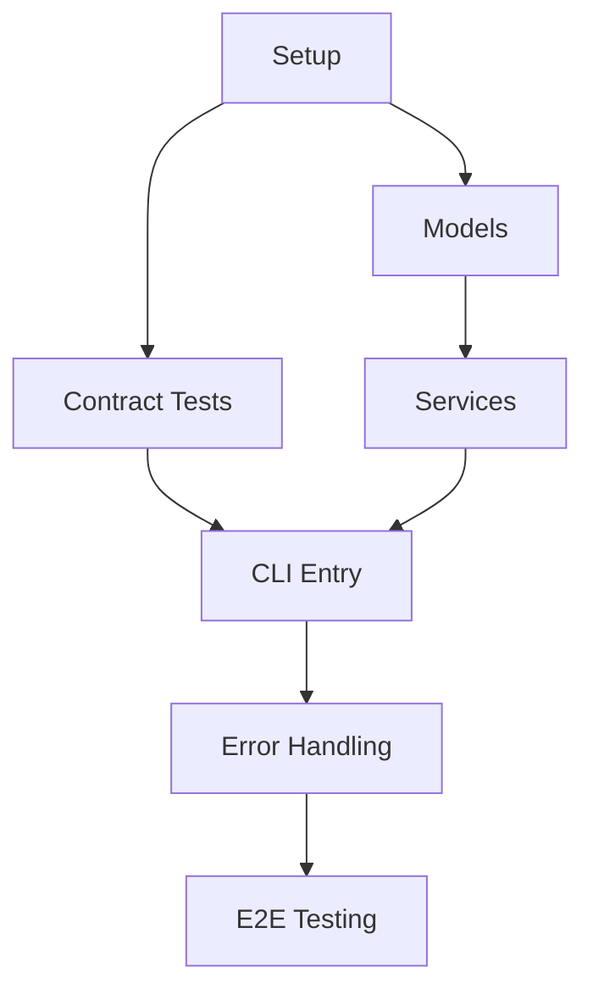

# Tasks: PhotoTransfer Console Application MVP

**Input**: Design documents from `C:/Users/gnnko/ref-test/specs/001-the-console-application/`
**Prerequisites**: plan.md (required), research.md, data-model.md, contracts/

## Execution Context: MVP Version
Creating a Minimum Viable Product that provides core photo indexing and date-based transfer functionality with essential features only.

## Path Conventions
- **Single project**: `src/`, `tests/` at repository root
- All paths relative to repository root: `C:/Users/gnnko/ref-test/`

## Phase 3.1: Setup

- [ ] **T001** Create .NET 9 console project structure
  - Create `src/PhotoTransfer/` directory
  - Create `src/PhotoTransfer/PhotoTransfer.csproj` with .NET 9, System.CommandLine, System.Text.Json references  
  - Create `tests/PhotoTransfer.Tests/` directory
  - Create `tests/PhotoTransfer.Tests/PhotoTransfer.Tests.csproj` with NUnit references

- [ ] **T002** Initialize solution and project dependencies
  - Create `PhotoTransfer.sln` in repository root
  - Add console project and test project to solution
  - Configure build and test scripts

- [ ] **T003** [P] Configure development tools
  - Create `.editorconfig` for C# formatting rules
  - Create `global.json` to specify .NET 9 SDK version
  - Create `.gitignore` for .NET projects

## Phase 3.2: Tests First (TDD) ⚠️ MUST COMPLETE BEFORE 3.3

### Contract Tests
- [ ] **T004** [P] Create CLI index command contract test
  - File: `tests/PhotoTransfer.Tests/ContractTests/IndexCommandTests.cs`
  - Test `phototransfer --index` command execution, exit codes, output format
  - Verify pulsating asterisk progress visualization appears
  - MUST FAIL initially (no implementation)

- [ ] **T005** [P] Create CLI transfer command contract test  
  - File: `tests/PhotoTransfer.Tests/ContractTests/TransferCommandTests.cs`
  - Test `phototransfer --YYYY-MM` command execution, exit codes, output format
  - Verify duplicate handling with numeric suffixes
  - MUST FAIL initially (no implementation)

### Integration Tests
- [ ] **T006** [P] Create photo indexing integration test
  - File: `tests/PhotoTransfer.Tests/IntegrationTests/PhotoIndexingTests.cs`  
  - Test full workflow: scan directory → extract metadata → save JSON
  - Use real test directories with sample images
  - MUST FAIL initially (no implementation)

- [ ] **T007** [P] Create photo transfer integration test
  - File: `tests/PhotoTransfer.Tests/IntegrationTests/PhotoTransferTests.cs`
  - Test full workflow: load index → filter by date → move files
  - Verify files moved correctly with duplicate handling
  - MUST FAIL initially (no implementation)

## Phase 3.3: Core Models

- [ ] **T008** [P] Create PhotoMetadata model
  - File: `src/PhotoTransfer/Models/PhotoMetadata.cs`
  - Implement fields: FilePath, FileName, CreationDate, FileSize, Extension, Hash, IsTransferred, TransferredTo
  - Add validation attributes and methods
  - Make T006 integration test pass for metadata extraction

- [ ] **T009** [P] Create PhotoIndex model  
  - File: `src/PhotoTransfer/Models/PhotoIndex.cs`
  - Implement fields: IndexedAt, WorkingDirectory, Photos, Version, TotalCount, SupportedExtensions
  - Add JSON serialization attributes
  - Make T006 integration test pass for index storage

- [ ] **T010** [P] Create ProgressIndicator utility
  - File: `src/PhotoTransfer/Utils/ProgressIndicator.cs`
  - Implement pulsating asterisk with Start(), Stop(), Update() methods
  - Use Console.SetCursorPosition and Timer for 500ms intervals
  - Make T004 contract test pass for progress visualization

## Phase 3.4: Core Services  

- [ ] **T011** Create PhotoIndexer service
  - File: `src/PhotoTransfer/Services/PhotoIndexer.cs`
  - Implement directory scanning, EXIF data extraction, metadata creation
  - Support jpg, jpeg, png, gif, bmp, tiff formats
  - Handle files without EXIF dates (use file system date)
  - Make T006 integration test pass

- [ ] **T012** Create MetadataStore service
  - File: `src/PhotoTransfer/Services/MetadataStore.cs`
  - Implement JSON save/load operations for PhotoIndex
  - Handle file versioning and error cases
  - Make T006, T007 integration tests pass for persistence

- [ ] **T013** Create PhotoTransfer service  
  - File: `src/PhotoTransfer/Services/PhotoTransferService.cs`
  - Implement file move operations with atomic safety
  - Handle duplicate files with numeric suffixes (photo(0).jpg, photo(1).jpg)
  - Create target directories as needed
  - Make T007 integration test pass

## Phase 3.5: CLI Implementation

- [ ] **T014** Create main CLI entry point
  - File: `src/PhotoTransfer/Program.cs`
  - Implement System.CommandLine setup for --index and --YYYY-MM commands  
  - Wire up all services and handle command routing
  - Make T004, T005 contract tests pass

- [ ] **T015** Create IndexCommand handler
  - File: `src/PhotoTransfer/Commands/IndexCommand.cs`
  - Implement --index command logic with options parsing
  - Integrate ProgressIndicator for visual feedback
  - Handle all exit codes and error scenarios
  - Make T004 contract test pass completely

- [ ] **T016** Create TransferCommand handler
  - File: `src/PhotoTransfer/Commands/TransferCommand.cs`
  - Implement --YYYY-MM command parsing and validation
  - Integrate PhotoTransfer service for file operations
  - Handle all exit codes and error scenarios  
  - Make T005 contract test pass completely

## Phase 3.6: Integration & Polish

- [ ] **T017** Add comprehensive error handling
  - Update all services to handle exceptions gracefully
  - Implement detailed error messages with file paths and operation context
  - Ensure partial operations can be recovered

- [ ] **T018** [P] Create unit tests for critical components
  - File: `tests/PhotoTransfer.Tests/UnitTests/PhotoMetadataTests.cs`
  - File: `tests/PhotoTransfer.Tests/UnitTests/ProgressIndicatorTests.cs`  
  - File: `tests/PhotoTransfer.Tests/UnitTests/ValidationTests.cs`
  - Test edge cases and validation rules

- [ ] **T019** End-to-end quickstart validation
  - Run complete quickstart scenarios from quickstart.md
  - Verify all example commands work correctly
  - Test with real photo collections

- [ ] **T020** [P] Create build and packaging scripts
  - Create `build.ps1` and `build.sh` scripts
  - Configure release packaging for cross-platform deployment
  - Document installation instructions

## Dependency Graph



## Parallel Execution Examples

**Parallel Group 1** (after T001-T003 complete):
```bash
# All contract and integration tests can run in parallel
Task T004: ContractTests/IndexCommandTests.cs
Task T005: ContractTests/TransferCommandTests.cs  
Task T006: IntegrationTests/PhotoIndexingTests.cs
Task T007: IntegrationTests/PhotoTransferTests.cs
```

**Parallel Group 2** (after tests written):
```bash
# All model classes can be created in parallel
Task T008: Models/PhotoMetadata.cs
Task T009: Models/PhotoIndex.cs
Task T010: Utils/ProgressIndicator.cs
```

**Parallel Group 3** (after integration complete):
```bash
# Documentation and packaging can run in parallel
Task T018: Unit tests
Task T020: Build scripts
```

## MVP Success Criteria

✅ **Core Functionality**:
- Index photos from directory with progress visualization
- Transfer photos by YYYY-MM date format  
- Handle duplicate files with numeric suffixes
- JSON metadata persistence

✅ **Quality Gates**:
- All contract tests pass (TDD compliance)
- All integration tests pass with real files
- Cross-platform compatibility (Windows, Linux, macOS)
- Error handling with recovery scenarios

✅ **Performance Targets**:
- Index 1000+ photos in under 10 seconds
- Metadata operations complete in under 1 second
- Minimal memory footprint during processing

**Total Estimated Tasks**: 20 tasks
**Critical Path**: T001 → T004-T007 → T008-T010 → T011-T013 → T014-T016 → T019
**Parallel Opportunities**: 12 tasks can run in parallel across 3 execution groups